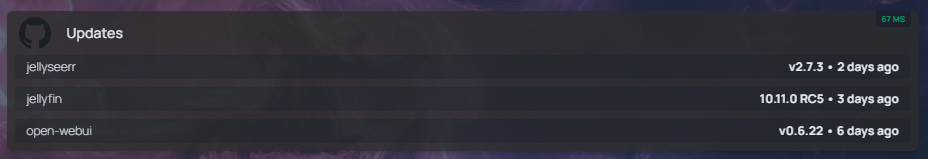

# rss-api

Simple API to fetch rss feeds for github releases using fresh rss



This allows you to easily integrate it with [https://gethomepage.dev/](https://gethomepage.dev/)

Example of services.yaml:

```
- Updates:
            icon: github.png
            href: http://192.168.0.11:5000
            siteMonitor: http://192.168.0.11:5000/freshrss/unread
            widget:
              type: customapi
              name: Unread RSS
              url: http://192.168.0.11:5000/freshrss/unread
              display: dynamic-list
              mappings:
                name: feed
                label: display
```

# Docker

You can configure environment variables directly in `docker-compose.yml` instead of using a `.env` file. Default values are provided, but you can override them as needed:

```
environment:
	FRESHRSS_USER: "user"
	FRESHRSS_PASS: "password"
```

Edit these values in your `docker-compose.yml` to match your setup.

## Running with Docker Compose

You can run the API using the pre-built image from GitHub Container Registry:

```bash
docker-compose up
```

This uses the image `ghcr.io/skulldorom/rss-api:latest`.

If you want to build locally, update `docker-compose.yml` to use `build: .` instead of the `image:` field.

### How to update

Go to the location where you ran git clone, `cd rss-api`

```
docker compose down
git pull origin main
docker compose up -d
```
