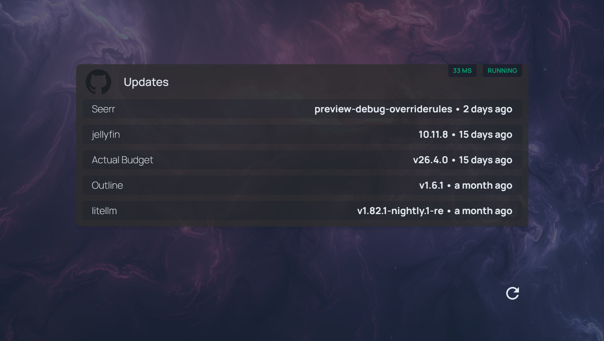

# rss-api

[](https://github.com/Skulldorom/rss-api/actions/workflows/test.yml)
[](https://github.com/Skulldorom/rss-api/actions/workflows/docker.yml)

Simple API to fetch rss feeds for github releases using fresh rss (powered by FastAPI)



This allows you to easily integrate it with [https://gethomepage.dev/](https://gethomepage.dev/)
Using their [Custom API integration](https://gethomepage.dev/widgets/services/customapi/)

## API Documentation

The API provides interactive documentation at:
- Swagger UI: `http://localhost:5000/docs`
- ReDoc: `http://localhost:5000/redoc`

## Available Endpoints

- `GET /freshrss/unread` - Fetch unread RSS items from FreshRSS
  - Optional query parameters:
    - `n` (integer, default `10`, valid range `1`–`100`) - Number of unread items to return
    - `category` (string) - FreshRSS category label to scope unread items, e.g. `/freshrss/unread?category=Tech`
- `GET /health` - Container health endpoint (does not require authentication)

## Authentication

Bearer authentication is **optional**. When `RSS_API_TOKEN` is not set the API
accepts all requests — convenient for trusted/internal networks. Set
`RSS_API_TOKEN` to a long random secret to require an `Authorization: Bearer <token>`
header on every protected endpoint. `/health` always remains unauthenticated.

Generate a long random token with OpenSSL and save it in `.env`:

```bash
RSS_API_TOKEN=$(openssl rand -hex 32)
printf 'RSS_API_TOKEN=%s\n' "$RSS_API_TOKEN" >> .env
```

```bash
# With auth enabled (token set):
curl \
  -H "Authorization: Bearer your-secret-token" \
  "http://localhost:5000/freshrss/unread?n=10&category=Tech"

# Without auth (token not set):
curl "http://localhost:5000/freshrss/unread?n=10&category=Tech"
```

When auth is enabled, clients such as Homepage must send the same header:

```yaml
headers:
  Authorization: Bearer your-secret-token
```

## Testing

Run the test suite with:

```bash
uv sync
uv run pytest
```

GitHub Actions runs these tests for pull requests and before publishing the Docker image from `main`.

Example of services.yaml:

```
- Updates:
            icon: github.png
            href: http://192.168.0.11:5000
            siteMonitor: http://192.168.0.11:5000/freshrss/unread
            widget:
              type: customapi
              name: Unread RSS
              url: http://192.168.0.11:5000/freshrss/unread
              headers:
                Authorization: Bearer your-secret-token
              display: dynamic-list
              mappings:
                name: feed
                label: display
```

# Docker

Copy the example environment file and set the required values:

```bash
cp .env.example .env
```

Configure these environment variables in `.env` or your Compose environment:

| Variable | Required | Default if unset | Description |
| --- | --- | --- | --- |
| `FRESHRSS_HOST` | Yes | No default; app startup fails. | FreshRSS base URL reachable from the API container. The example `.env` uses `http://freshrss` for a same-network Compose service. |
| `FRESHRSS_USER` | Yes | No default; app startup fails. | FreshRSS username used for Google Reader API login. |
| `FRESHRSS_PASS` | Yes | No default; app startup fails. | FreshRSS password used for Google Reader API login. |
| `RSS_API_TOKEN` | No | Empty/unset; bearer auth disabled. | Optional bearer token for this API. When set, protected endpoints require `Authorization: Bearer <token>`. |

`FRESHRSS_HOST` must be a URL that is reachable **from the API container**. Do
not use `localhost`: inside the container that name refers to the API container
itself, not FreshRSS. Compose validates `FRESHRSS_HOST`, `FRESHRSS_USER`, and
`FRESHRSS_PASS` before creating the container, so an unset or empty value
produces a clear configuration error instead of entering a restart loop.

Choose one of the following host configurations.

### FreshRSS in the same Compose project

When FreshRSS is a service on the same Compose network, use its service name.
For example, if the service is named `freshrss`:

```yaml
services:
  freshrss:
    image: freshrss/freshrss:latest
    # Add the FreshRSS volumes and other settings required by your deployment.

  custom-api:
    image: ghcr.io/skulldorom/rss-api:latest
    environment:
      FRESHRSS_HOST: http://freshrss
      FRESHRSS_USER: ${FRESHRSS_USER:?Set FRESHRSS_USER in .env}
      FRESHRSS_PASS: ${FRESHRSS_PASS:?Set FRESHRSS_PASS in .env}
      # Optional: require Authorization: Bearer <token> on protected endpoints.
      RSS_API_TOKEN: ${RSS_API_TOKEN:-}
```

Equivalently, keep the provided Compose file and set this in `.env`:

```dotenv
FRESHRSS_HOST=http://freshrss
```

### FreshRSS on the Docker Desktop host

Docker Desktop provides `host.docker.internal` for reaching a service exposed
by the host. If FreshRSS is published on host port `8020`, use:

```dotenv
FRESHRSS_HOST=http://host.docker.internal:8020
```

### FreshRSS on a Linux host

On Linux, set the host's address explicitly (replace the example address with
one reachable from Docker):

```dotenv
FRESHRSS_HOST=http://192.168.1.10:8020
```

Alternatively, map Docker's host gateway in `docker-compose.yml` and then use
the same hostname as the Docker Desktop example:

```yaml
services:
  custom-api:
    extra_hosts:
      - "host.docker.internal:host-gateway"
```

```dotenv
FRESHRSS_HOST=http://host.docker.internal:8020
```

## Running with Docker Compose

You can run the API using the pre-built image from GitHub Container Registry:

```bash
docker compose up
```

This uses the image `ghcr.io/skulldorom/rss-api:latest`.

If you want to build locally, update `docker-compose.yml` to use `build: .` instead of the `image:` field.

### Health check

The container image defines a Docker `HEALTHCHECK` that calls `GET /health`.
If you want to override it in `docker-compose.yml`, you can add a service-level `healthcheck` block.

### How to update

Go to the location where you ran git clone, `cd rss-api`

```
docker compose down
git pull origin main
docker compose up -d
```
